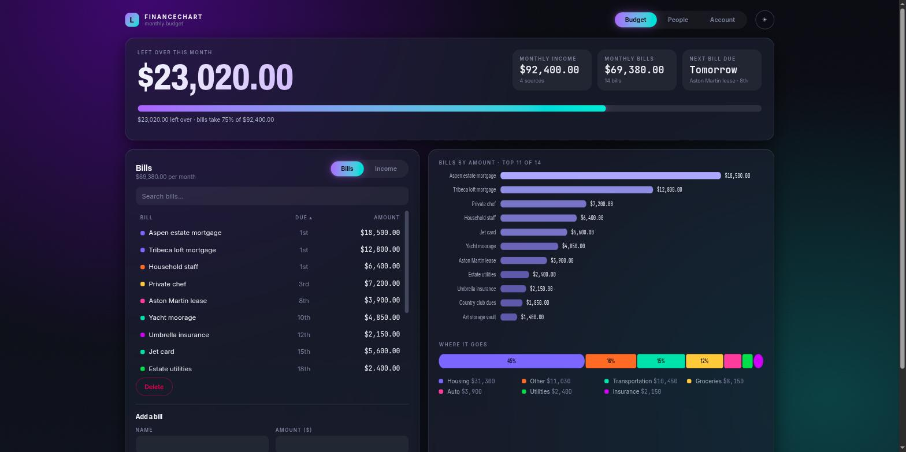
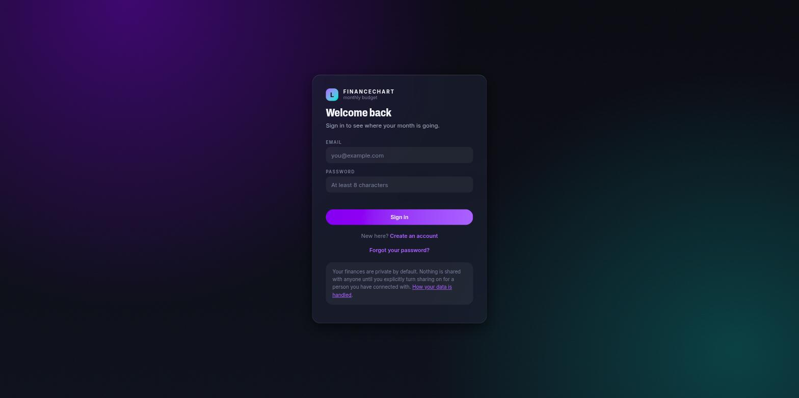
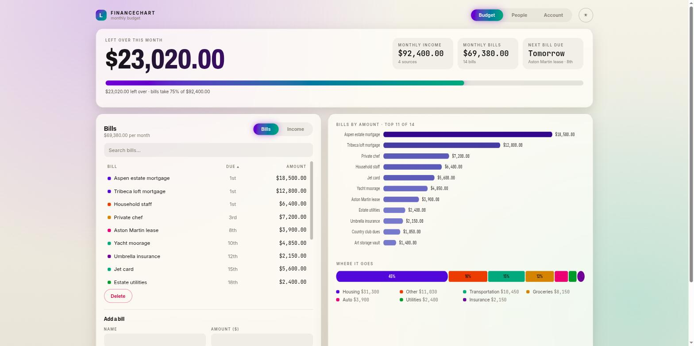

# FinanceChart

A budget tracker for recurring bills and income, built so two people can plan
together without handing each other a spreadsheet.



My partner and I are saving for a house. I wanted one number — what's actually
left over each month — for each of us, plus the option to show each other the
detail without either of us being obliged to. That's the whole product.

**[Open the app →](https://robinson-erc.github.io/FinanceChart/)**

## What it does

- **Real accounts.** Email and password, one budget per person.
- **Private by default.** Your figures are yours. Nobody sees them until you
  connect with a person *and* switch sharing on — two deliberate steps.
- **Opt-in, one-directional sharing.** Each side controls its own switch
  independently, sharing is read-only, and either of you can turn it off at any
  moment.
- **Each of you labels the other.** You pick the word for them (partner, wife,
  husband, fiancé, housemate, friend, whatever fits) and they pick the word for
  you. Relationships are rarely symmetric in language — one person's girlfriend
  is the other's boyfriend — so neither label is imposed on the other, and the
  database will not let one side write the other's.
- **The month at a glance.** What's left over, a meter showing how much of your
  income the bills consume, bills ranked by size, and where the money goes by
  category.
- **Anonymised reporting export** for Power BI — amounts and categories only,
  never names or descriptions.
- **Your own data, any time.** Every user can download a full copy of their
  records.
- Light and dark, both deliberately designed rather than one inverted.

| Sign in | Light mode |
|---|---|
|  |  |

## How privacy actually works

This matters more than the features, so it's worth being precise.

The frontend is static files on GitHub Pages. Anyone can read that code, and
anyone can modify their copy of it. So **it is never trusted to decide who sees
what.** Every request goes to Postgres as the signed-in user, and row-level
security policies decide what comes back. If someone rewrote the page to ask for
another person's bills, the database would return nothing.

The rules are in [`supabase/schema.sql`](supabase/schema.sql) — about 60 lines of
policy you can read in full. The short version:

- You may read and write your own rows, always.
- You may read someone else's rows only if there is an *accepted* connection
  between you **and** they have set their own sharing flag. Two conditions,
  both required.
- You may never write to someone else's rows. Sharing is read-only.
- The reporting export runs as a `SECURITY DEFINER` function that checks the
  admin flag itself, and returns a pseudonymous household key, category, amount
  and date. Names, emails and bill descriptions never leave the database — a
  description like "Aspen estate mortgage" identifies a household on its own.

The full plain-English version is at [`web/privacy.html`](web/privacy.html), and
it's linked from the sign-in screen.

## Running it yourself

**1. Create a Supabase project** at [supabase.com](https://supabase.com) — the
free tier is plenty for a household.

**2. Run the schema.** Dashboard → SQL Editor → New query, paste
[`supabase/schema.sql`](supabase/schema.sql), run. It's idempotent, so re-running
is safe.

**3. Point the frontend at it.** In `web/config.js`, set `SUPABASE_URL` and
`SUPABASE_ANON_KEY` from Dashboard → Project Settings → API.

> Both values are safe to commit. The anon key identifies the project; it does
> not grant access. Never put the **service role** key there — that one bypasses
> every policy.

**4. Serve it.** Any static host. Locally:

```bash
cd web && python3 -m http.server 8000
```

Pushing to `main` deploys to GitHub Pages automatically via
[`.github/workflows/pages.yml`](.github/workflows/pages.yml).

**5. Make yourself an admin** (only needed for the reporting export). After
signing up, in the SQL editor:

```sql
update profiles set is_admin = true
where id = (select id from auth.users where email = 'you@example.com');
```

## Layout

| Path | What it is |
|---|---|
| `web/` | The site. Plain HTML, CSS and ES modules — no build step, no framework. |
| `supabase/schema.sql` | Tables, row-level security policies, and the export functions. |
| `desktop/` | The original Python app (v1). Still runs standalone on CSV files. |
| `docs/screenshots/` | Images for this README. |

The only runtime dependency is `@supabase/supabase-js`, loaded from a CDN. No
bundler, no `node_modules`, nothing to install to work on the frontend.

## Design notes

**Colour is measured, not picked.** The palette came out of
[`desktop/palette_check.py`](desktop/palette_check.py), which audits WCAG contrast
and OKLab separation between adjacent series colours under simulated protanopia,
deuteranopia and tritanopia. It caught two things I'd otherwise have shipped: two
series sat 6.7 ΔE apart under tritanopia against a floor of 8, and the sequential
ramp started at 1.5:1 against the background, which is invisible.

Colour is also assigned by the job it does. Bill magnitude uses one hue's ramp,
so the bars read as a single measure. Categories use fixed slots, so a category
keeps its colour as the data changes. Past eight categories the tail folds into
"Other" rather than inventing a ninth hue nothing could distinguish. Text drawn
on a coloured fill picks black or white per colour — on the light palette several
series are dark enough that black would fail.

**Status colour never carries meaning alone.** When bills exceed income the hero
figure goes red *and* the meter runs past the end of its track *and* the caption
says "Bills exceed income by $X". Any one of those could be missed.

**Nothing is silently truncated.** The bar chart shows the largest bills that
fit; when there are more, the heading says "top 11 of 14" rather than letting a
partial view pass for the whole picture.

## History

**v1** ([tag](https://github.com/Robinson-erc/FinanceChart/releases/tag/v1.0)) was
a Python desktop app with a hand-painted Tkinter interface — every frame
composited with Pillow onto a single canvas, because ttk can't do frosted panels
or condensed display type. It still works: `cd desktop && python main.py`. It's
kept because the visual language of the web app came directly from it, and
`palette_check.py` is still the tool that validates the colours.

**v2** is this: same design, real accounts, a database, and a URL I can send to
someone.

## Known limitations

- Monthly recurring amounts only — no one-off transactions, no history, no
  forecasting beyond the next due date.
- Single currency, formatted as USD.
- A household's combined view is per-person: you switch between budgets rather
  than seeing one merged total.
- Not independently security-audited. The privacy model is enforced in the
  database and I've documented exactly how, but this is a personal project, not
  a regulated financial product.
