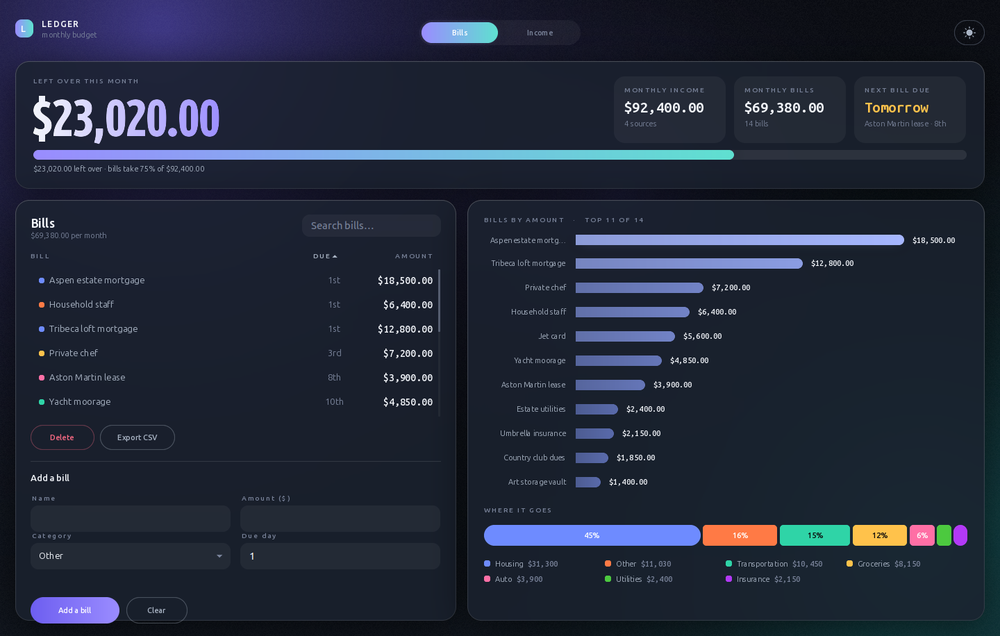
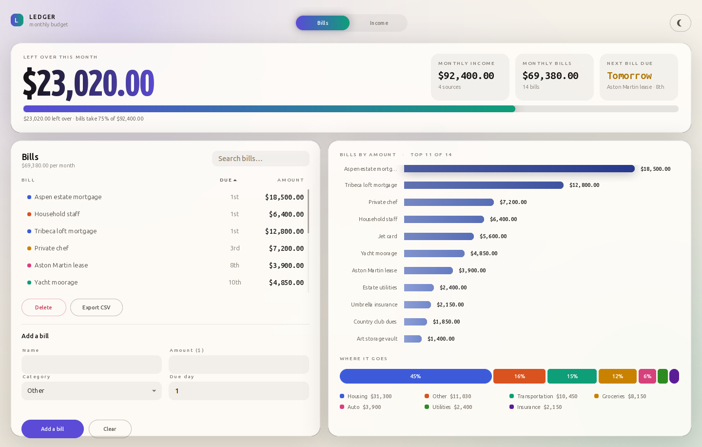
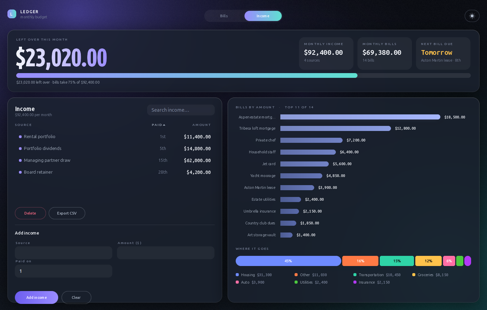
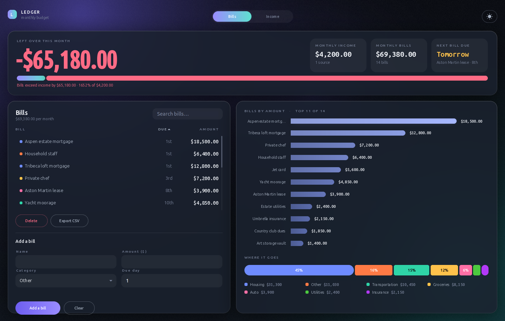

# Ledger

A desktop budget tracker for recurring bills and income. Python, Tkinter, and a
lot of Pillow.



I wanted to know one number — what's actually left over each month — without
opening a spreadsheet. That's the headline figure, and everything else on screen
explains it.

## What it does

- Track recurring **bills** (name, amount, category, day of the month) and
  **income** sources in two tabs that share the same table, search, sort and
  editor.
- A **meter** showing what share of your income the bills consume. Go over and
  it keeps drawing past the end of the track in red rather than capping at 100%.
- **Bills by amount** and a **category split**, both redrawn as the data changes.
- Everything is stored as plain CSV next to the code. Edit it by hand, diff it,
  keep it in git — it's four columns.
- Light and dark, both deliberately designed rather than one inverted.

## Running it

```bash
python3 -m venv .venv
.venv/bin/pip install -r requirements.txt
.venv/bin/python main.py
```

One dependency: Pillow. The interface is drawn, not assembled from widgets, so
there's no UI toolkit beyond what ships with Python.

The repo includes a demo month in `bills.csv` and `income.csv` so there's
something on screen the first time you run it. Delete both files to start empty.

## Screenshots

| Light mode | Income tab |
|---|---|
|  |  |

When bills exceed income, the hero figure goes negative and red, the meter
overruns its track, and the caption says so in words — the colour never carries
that meaning on its own:



## How it's built

| File | What it owns |
|---|---|
| `main.py` | Entry point. |
| `models.py` | `Bill`, `Income`, validation, and the monthly summaries. |
| `storage.py` | CSV persistence, one repository per record type. |
| `theme.py` | The palette, type scale and metrics, for both modes. |
| `paint.py` | Pillow primitives: gradients, frosted glass, shadows, glow, type. |
| `charts.py` | The three data marks, drawn by hand. |
| `ui.py` | Painted components — panels, buttons, table rows, the modal. |
| `app.py` | Layout, render orchestration, and event routing. |
| `palette_check.py` | Colour audit. Run it after touching the palette. |

### The interface is painted, not assembled

ttk can't express any of the look I was after — no frosted panels, no gradient
fills, no rounded data-ends, no condensed display type. So the whole window is
one `tk.Canvas`. Each frame is composited as a single Pillow image and blitted;
real `tk.Entry` widgets are floated only over the fields that need a caret.

That trade is worth being honest about. I gave up every widget behaviour Tk
provides for free — hit testing, hover, focus rings, scrolling, z-order — and had
to write all of it. `ui.py` draws components and records the rectangle each one
occupies; `app.py` routes clicks and hovers against that registry. In exchange I
get to decide what every pixel does.

Two bugs came directly from that choice and are worth knowing about if you read
the code. Tk widgets always stack above the canvas, so the entries punched
straight through the modal scrim and the open dropdown until I withdrew them
while an overlay is up. And Pillow has no letter-spacing, so tracked labels are
drawn a glyph at a time — anchoring each glyph to its own top instead of a shared
baseline left commas and periods floating at cap height.

### Rendering stays interactive by layering

A naive full repaint was 75 ms — visibly laggy on hover. Three layers of caching
brought it to about 21 ms:

- The plane and its frosted panels are composited once per size and theme.
- Charts are rebuilt only when their data, size or theme changes.
- Rounded shapes, blurred shadows and rasterised text are memoised. Text was the
  biggest win: 520 draw calls were producing 2050 glyph renders per frame.

### Colour is measured, not eyeballed

`palette_check.py` audits both modes and exits non-zero on a failure. It checks
WCAG contrast for every ink and control, and separation between adjacent
categorical slots in OKLab — for normal vision and for simulated protanopia,
deuteranopia and tritanopia.

It caught two things I'd have shipped otherwise: the green and violet series
slots were 6.7 ΔE apart under tritanopia (the floor is 8), and the sequential
ramp started at 1.5:1 against the surface, which is invisible. Both were fixed by
searching for passing steps rather than nudging hex values by eye.

Colour is also assigned by the job it does. Bill magnitude uses one hue's ramp,
so the bars read as one measure. The category split uses fixed categorical slots,
so a category keeps its colour when the data changes. Past eight categories the
tail folds into "Other" instead of inventing a ninth hue that nothing could
distinguish.

### The data layer is boring on purpose

`models.py` and `storage.py` have no idea a UI exists. `Bill.parse` takes raw
strings and either returns a valid record or raises `ValidationError` with a
message written for a person; the interface's only job is to display it. Writes
go to a temp file and get renamed over the target, so an interrupted save leaves
the previous file intact rather than a truncated one. Rows that fail to parse are
skipped on load instead of taking the whole file down.

## Tests

The data layer is covered directly. The interface is driven headlessly through
its own hit registry — the same path a real click takes — across add, edit,
rename, duplicate-replace, delete, search, sort, scrolling, both dropdowns, the
confirm modal, empty and overspent states, and both themes.

That suite earned its keep: it caught a regression where search stopped matching
categories, because the category had become a coloured dot rather than a table
column and the filter only looked at rendered columns.

## Known limitations

- Monthly recurring amounts only. No one-off transactions, no history, no
  forecasting beyond the next due date.
- Single currency, formatted as USD.
- The window is sized for a desktop display and looks cramped below about
  1180×812.
- Font paths in `theme.py` point at Ubuntu's variable fonts and fall back to
  DejaVu. On another distro you may want to change those.
